# First Person Crawler Plugin for GB Studio

Created by Mike MacLean (c)2024 grimmrobegames.itch.io - All rights reserved.

Copying and distribution of the the source files for this plugin without the author's express permission is not permitted. Please respect my work and compensate me for my labour by purchasing this plugin at [https://grimmrobegames.itch.io/](https://grimmrobegames.itch.io/dungeoncrawlerplugin)

## Installing and setting up the plugin

1. Download the appropriate archive of the plugin for your installed version of GB Studio (either 3.2.1 or 4). Unzip the file and copy the _plugins_ folder to the root of your GB Studio as per the GB Studio [docs](https://www.gbstudio.dev/docs/extending-gbstudio/plugins). Alternatively, you can open the example project `FirstPersonCrawler.gbsproj`, which has a complete setup, to use as a template.
2. Add a new scene to the project and set its _Type_ to _First Person Dungeon Crawler_ if using GB Studio 4 or _Point and Click_ if using version 3.2.1.
3. Set the background to the _crawler_ image provided by the plugin. Optional: Set the _Player Sprite Sheet_ to the _empty_ image provided with the plugin.

_GB Studio version 4_
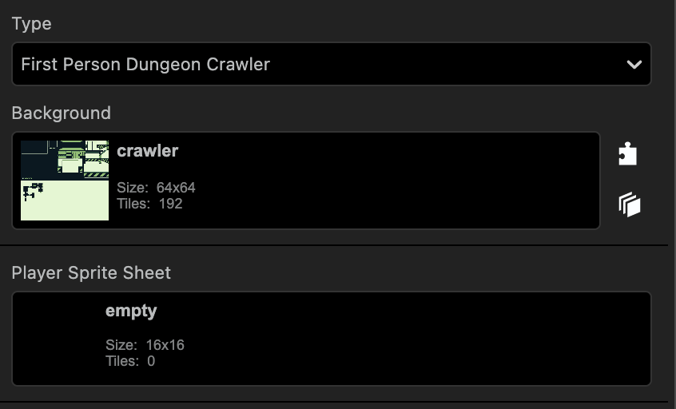

_GB Studio version 3.2.1_
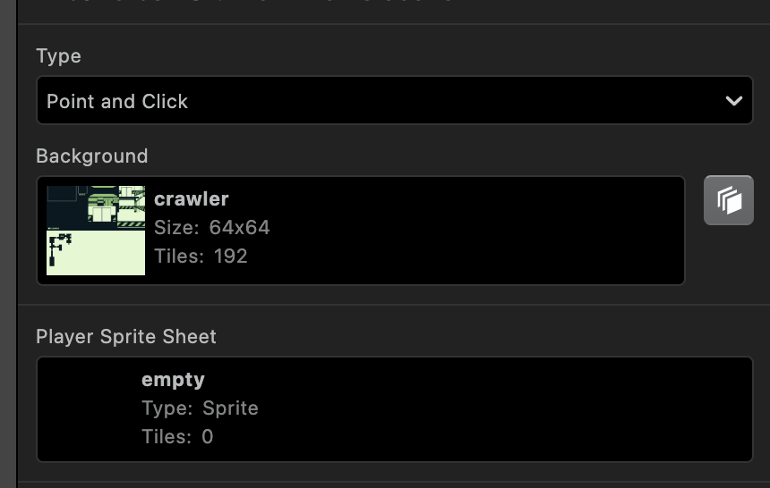

4. Add a new actor to the scene and name it something like "special actor". Go to the actor's _On Update_ tab and check _Keep Running While Offscreen_. Set the actor's _Collision Group_ to 1. Optional: Set the actor's _Sprite Sheet_ to the _empty_ image provided with the plugin.

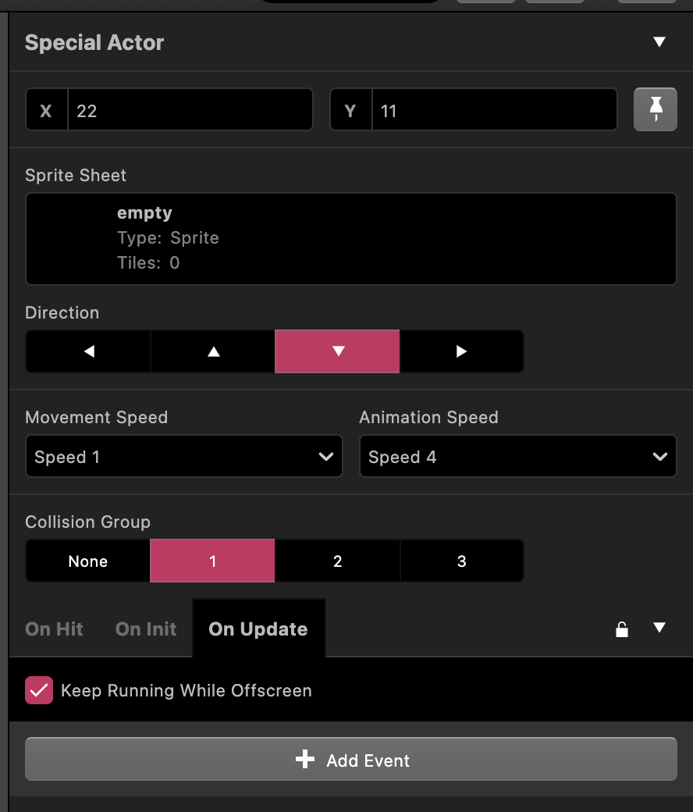

5. Select the scene and click the _+ Add Event_ button to add a _Dungeon Crawler Events > Dungeon Crawler Init_ event to the _On Init_ tab. Assign the actor you created in step 4 to the event. Optional: change the input settings in the event.

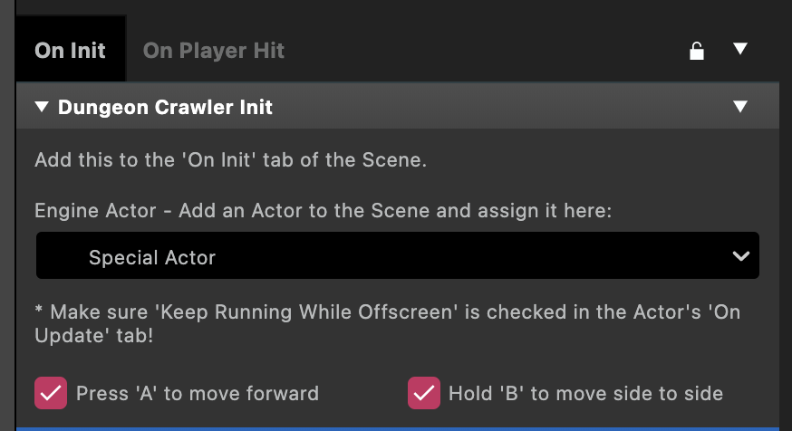

6. Position the player to the desired starting position on the map.

This is enough to get the scene running if you press play. In order to interact with the special tiles, see _Interacting with Special Tiles_ later in this guide.

### Controls
Up to move forward 1 tile, Down to move back 1 tile, Left and Right to turn 90 degrees. If *Press A to move forward* is checked in the *Dungeon Crawler Init* event then the A button moves the player 1 tile forward. If *Hold B to move side to side* is checked then holding the B button and pressing Left or Right will move the player 1 tile to the left or right instead of turning.

## Breakdown of background image

The following is the background image included in with the plugin. It contains a maximum of 192 unique tiles, a limit of the GB Studio engine (and not an unreasonable limit considering the Game Boy's modest VRAM), and is 512px by 512px, or 64 by 64 tiles, in size. Note, the image is cut short for demonstration purposes. The background can be taller or shorter to make larger or smaller maps as long as it is within the limits of GB Studio background sizes, but the plugin requires the image width to be 512px or 64 tiles.

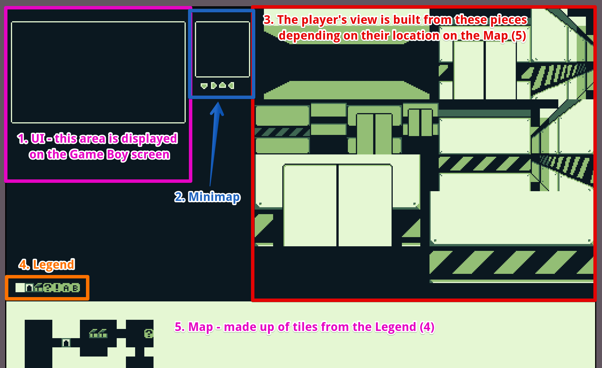

1. **The UI:** This portion of the image is what's displayed on the Game Boy screen while using the plugin. The border in this section is intentionally simple and the rest of the screen is blank, but it can be as detailed as you'd like as long as the entire background image is only 192 unique tiles. A big part of using this plugin is balancing the tile count. For my jam game [Abducted](https://grimmrobegames.itch.io/abducted), I chose to keep the UI simple so I could add more detail to the rendered view.
2. **The Minimap:** When displayed, the minimap is drawn over the bottom right corner of the screen. It's rendered by drawing first the border, then the tiles from the Map (5) area surrounding the player, and finally the player's direction in the centre using one of the 4 arrows. If you won't be using a minimap, you can potentially save some unique tiles by removing this border and directional arrows from the image.
3. **The View:** This section is all the pieces that are put together to create the first person view. This is described in greater detail in the next section.
4. **The Legend:** The map is made up of these 8 tiles and they are technically the only 8 tiles that are "required" by the plugin. They must be at positions (0, 30) to (7, 30) and represent the following in this order: open, wall, door, then 5 special tiles. The special tiles and how to make use of them is described later.
5. **The Map:** This is the map that the player moves through, made up of the 8 tiles defined in the Legend (4). It starts at tile (0, 32) and ends at (63, 63) in this image but can be taller as long as the image size is within GB Studio's [background size limit](https://www.gbstudio.dev/docs/assets/backgrounds#size-requirements).

## Building the view

To render the first person view the plugin takes a 3 tiles wide by 4 tiles deep rectangle of tiles in front of the player from the Map (5) and draws their corresponding pieces from the View (3) onto the view area of the UI (1). Observe the following animated gif to see this happening. Note, here the minimap has been modified from the plugin to show the whole rectangle:

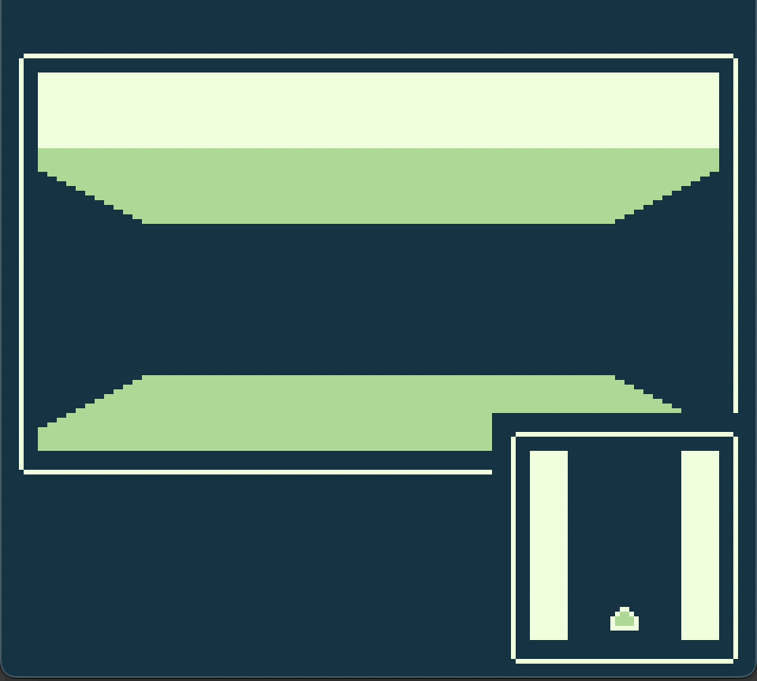

The rendering uses a "painters algorithm", in that it starts from the farthest tiles and works its way to the tiles closest to the player. Drawn first is the background, then any tiles 4 spaces away, then 3 spaces, and so on.

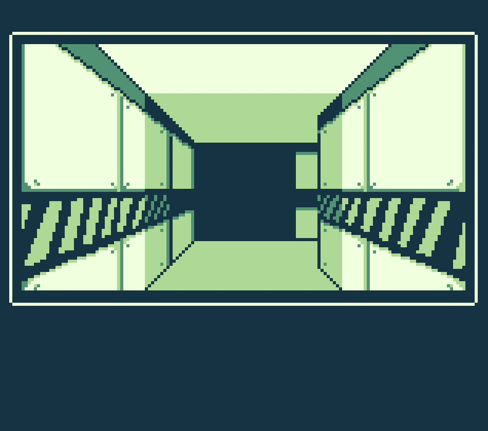

The following image breaks down the pieces by their distance from the player:

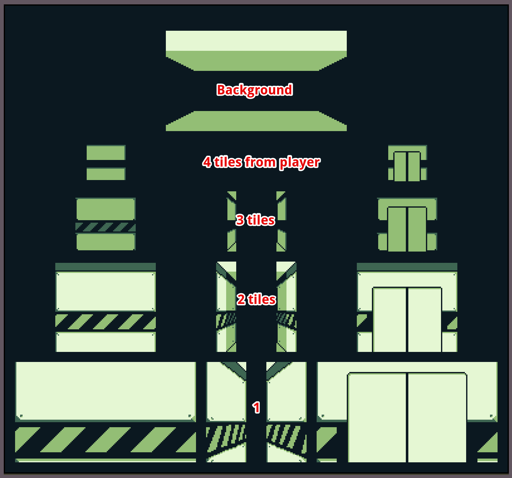

While the above image can be used for reference in understanding the different pieces and how they create the view, the plugin requires the various pieces to be packed in the exact configuration as seen in the _crawler.png_ background image.

## Creating Maps using the Legend

Making maps is as simple as drawing them on the bottom portion of the _crawler.png_ image. As long as you use the tiles defined in the Legend area, (0, 30) to (7, 30), and like with any GB Studio background image you stay on an 8px by 8px grid, the plugin will read the tiles and render the view accordingly. Any image editing software can be used for this process, or your favourite 2D level editor such as [Tiled](https://www.mapeditor.org/) with a bit of initial setup.

For example, I use [Aseprite](https://www.aseprite.org/) to do all my pixel art so I used it to draw my maps as well. Using an 8px by 8px grid, I can select tiles and fill them with either the "open" color or "wall" color to create rooms and corridors, since those tiles are simply a single colour. Then I can copy and paste the door or special tiles and move them around while holding the _shift_ key to keep them locked to the grid.

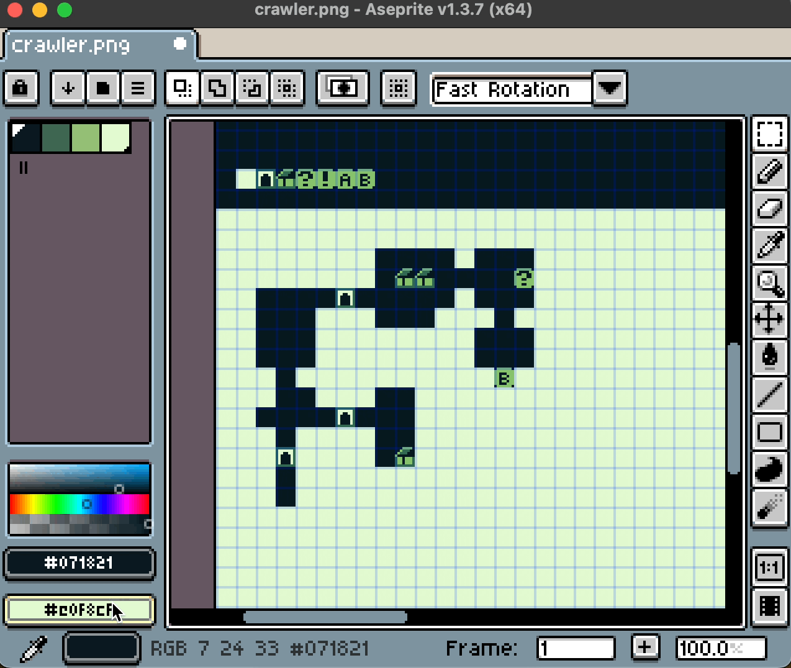

Every pixel editing app is a little different, but most have a grid setting and a "snap to grid" or equivalent option.

## Using Actors with the View Sprite event

Adding actors to the map is similar to a typical top-down GB Studio project, however since we don't see the map area we have to add a special event to render the sprite onscreen. Follow these steps to get actors in the scene and interactive:

1. Add a new actor to the scene and position it to the desired location on the map. Optional: change it's _Sprite_ to the _npc_ image provided with the plugin. The _npc_ and _lock_ sprites will not appear in the game, they are simply placeholders to help see more clearly the position and purpose of the actor in the scene editor.
2. Set the _Collision Group_ to 1 and in the _On Update_ tab check _Keep Running While Offscreen_.
3. In the _On Hit_ tab, select _Group 1_ and click the _+ Add Event_ button to add a _Dungeon Crawler Helpers > Dungeon Crawler Sprite_ event. This event placed in _Group 1_ lets the plugin show a sprite on the screen when the player is facing the actor on the map. Choose a sprite to display under _View Sprite_ and set its position to the desired location. Choose an animation state if desired or leave it on _Default_.

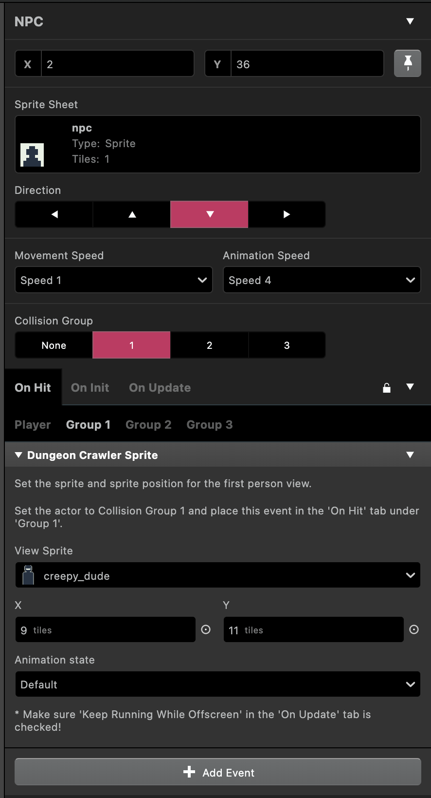

4. In the _On Hit_ tab, select _Player_ and add any desired events triggered by interacting with the actor, such as dialog. This is the same as any typical GB Studio project.

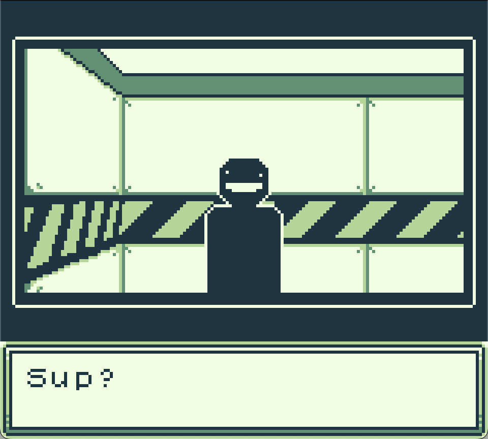

## Interacting with Special Tiles

Making the special tiles on the map function is similar to using actors as described above but requires an addition event, the _Dungeon Crawler Get Tile Type_ event.

1. Select the special actor from step 4 of **Installing and setting up the plugin**.
2. In the _On Hit_ tab, select _Group 1_ and click the _+ Add Event_ button to add a _Dungeon Crawler Helpers > Dungeon Crawler Get Tile Type_ event. Assign unique variables to each of the _Tile type variable_, _Tile X variable_, and _Tile Y variable_. Local 0, Local 1, and Local 2 will suffice unless you have a reason to use global variables.
3. Click the _+ Add Event_ button again to add a _Switch_ event. Assign the _Tile type variable_ as the variable to use (Local 0 if you used the suggestion from the previous step) and set the _Number of options_ to the number of special tiles your map uses. If using all 5, for example, then set this to 5.
4. For each special tile your map uses, set the _When_ value of the _Switch_ event to the corresponding special tile number and then click the _+ Add Event_ button to add a _Dungeon Crawler Helpers > Dungeon Crawler Sprite_ event. Set the desired _View Sprite_ and onscreen position for when the player faces this tile type.
   Reminder, the special tiles are numbered 3 to 7. So, for example, if we wanted special tile 3 to appear as a chest, we would set the _When_ to 3 and then set the _View Sprite_ to the _chest_ image.

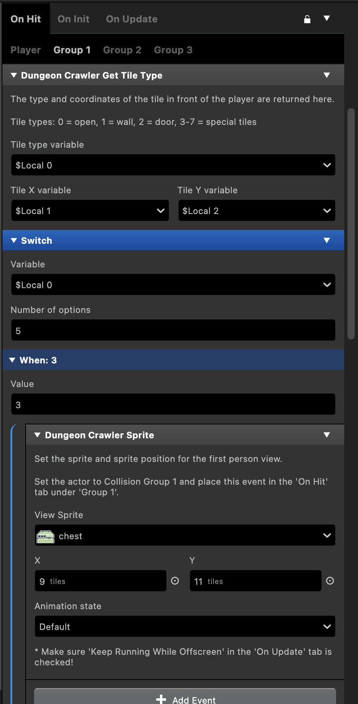

5. To let the player interact with the special tiles, we repeat steps 2 and 3 but this time under the _On Hit > Player_ tab. Set the _When_ value of the _Switch_ event to the corresponding special tile number and add any desired events triggered by interacting with the special tile, such as dialog. This is where we can use the returned values from _Tile X variable_ and _Tile Y variable_ to differentiate between multiple of the same tile type.

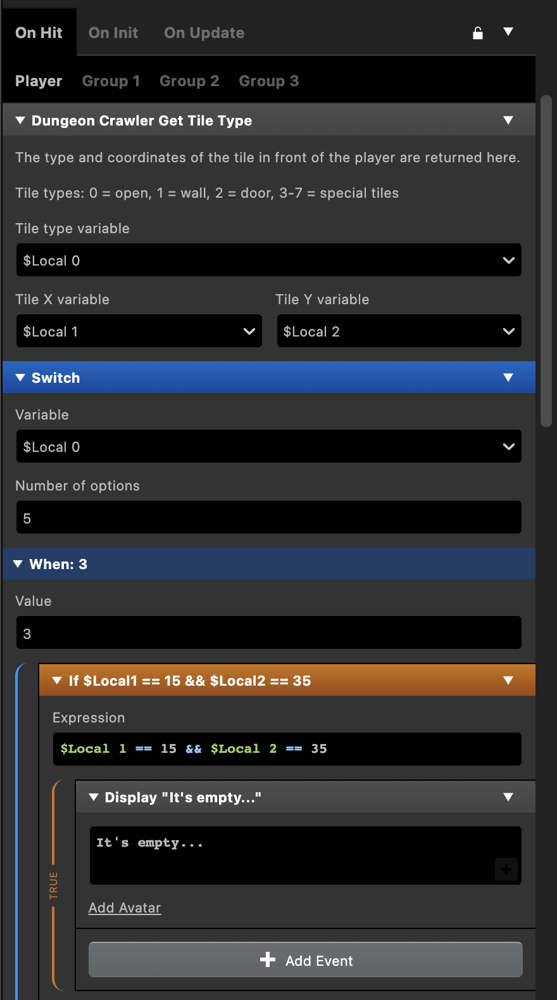

See the `FirstPersonCrawler.gbsproj` project included with the plugin for a complete example of this setup.

## Other events included in the plugin

### Minimap toggle

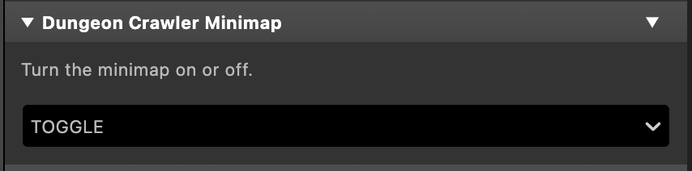

This event, _Dungeon Crawler Helpers > Dungeon Crawler Minimap_, allows you to toggle the minimap, or to set it on or off explicitly.

### Darkness toggle

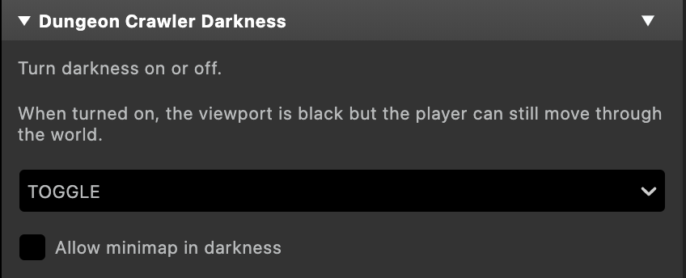

This event, _Dungeon Crawler Helpers > Dungeon Crawler Darkness_, allows you to toggle whether the first person view renders or appears as a black screen. It can be toggled, or set to on or off explicitly. Additionally, there is an option to allow the minimap to be displayed while the scene is in darkness.

## Caveats

### Doors

Due to the limited number of unique tiles allowed in a GB Studio background, doors do not have a side view and can only be seen from the front. To avoid confusion, it's recommended that you place doors in corridors set back 1 tile. See the example project to better understand this.

### GB Studio events

Many of the standard GB Studio events you may be used to working with are not compatible with the plugin. Anything that moves the player or actors on the map area by partial tile distances will likely have unexpected results. Additionally, since the player and map actors never appear onscreen, any events relating to their visual appearance will have no visible effect. Keep these limitations in mind.
